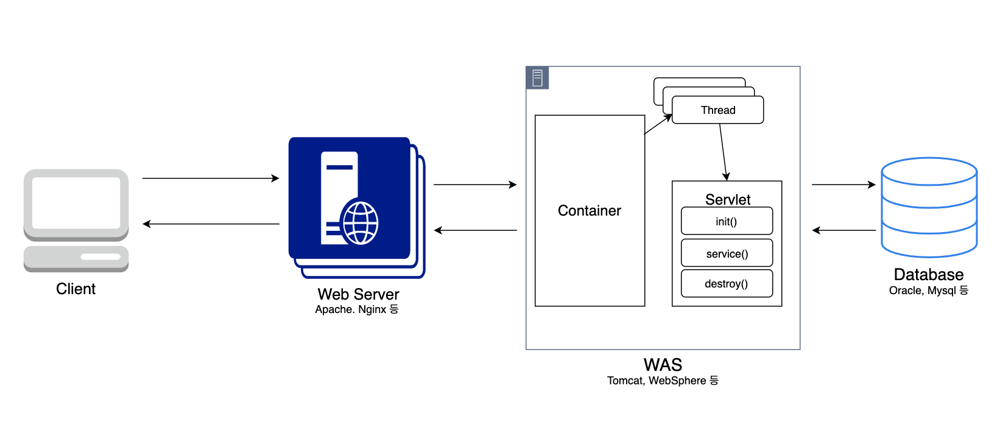

Server Program (Servlet)
=========

> 날짜 : 19.06.27

## WebServer & WAS

<center></center>

### Web Server
- 기본적으로 Http 프로토콜을 기반으로 한 요청에 맞는 **Static Content**(파일)을 Client에게 제공하는 역할
- 동적인 요청은 WAS에 넘김
> **어떻게 넘기지?**
WAS에서 처리할 요청들을 미리 XML 등의 설정파일을 이용하여 설정하고, 해당 패턴하는 요청을 받으면 WAS로 넘기는 형식.

### WAS
- DB와 연동하여 다양한 비즈니스 로직을 처리하기 위해 만들어진 Application Server
- 대부분의 경우 Web Server의 기능(static content 제공)을 포함.
> **등장 배경**
기존 Web Server는 요청에 따른 정적인 파일만 제공하기 때문에, Client에 로직이 들어있어야 했음. 이에 따라 Client 프로그램의 부하, 로직 변경에 따른 Client 패치, 보안 문제 등의 문제가 발생. 이를 해결하기 위해 미들웨어 개념의 WAS가 등장.

#### WebServer와 WAS를 함께 사용하는 이유
- WAS에서도 Web Server의 기능을 충분히 제공하기 때문에 WAS만 써도 서비스 가능.
- 예전에는 static content 요청과 dynamic content 요청을 분리하여 부하 분산 등의 이유로 나누어서 사용.
- 지금의 WAS -> 굳이 나누지 않아도 충분히 고성능
- But, 그럼에도 현업에서는 함께 사용.
    - Web Server는 WAS보다 상대적으로 간단한 구조
    - 대용량 웹 어플리케이션은 여러 대의 서버로 운영
    - WAS에서 문제가 발생하는 경우 Web Server에서 WAS가 문제 수정 후 재시작 할 때까지 해당 WAS를 이용하지 못 하도록 막아둠.
    - 서비스 이용자는 WAS의 이상을 느끼지 못하고 서비스 이용 가능.
    - => 장애 극복 (Fail over)에 유리한 구조

#### 동작 순서
1. Client에서 Servlet을 요청
2. 웹 서버에서 Servlet 요청을 인식하여 WAS의 Container에 요청을 넘김.
3. Container는 Thread를 생성하여 Servlet 객체를 이용하여 작업 수행
    3-1. Servlet의 `init()` 메소드를 호출하여 객체 생성 (해당 Servlet이 처음 요청인 경우)
    3-2. 생성된 객체는 메모리에 남아서 Tomcat 자원 해제 시 까지 남아있음(Singleton)
    3-3. 수행 시 마다, WAS의 ThreadPool을 이용하여 Thread를 생성, 호출하고 생성된 Thread에 Servlet을 할당하여 요청 수행 (여러 요청이 한 번에 들어와도 수행속도가 빠름)
    3-4. `service()` 메소드(요청에 따라 `doGet()`, `doPost()`로 분기)를 통해 요청 수행함.
    3-5. 요청 작업 종료 시, Thread 종료
4. 요청 처리결과를 Web Server에 전송
5. Web Server는 Client에게 결과 전송

#### 
    

## Servlet & JSP

JSP를 실행하게 되면 JSP => Servlet => HTML의 변환과정을 거쳐 Client에게 전달됨.

JSP 예제
```java
    // HelloServlet
    public class HelloServlet extends HttpServlet{
        ...
        protected void doGet(HttpServletRequest request, HttpServletResponse response)...{
            String id = request.getParamter("id");

            response.setContentType("type/html;charset=UTF-8");
            response.setCharacterEncoding("UTF-8");

            // redirect 방식
            response.sendRedirect("ok.jsp?id=" + id);

            // forward 방식
            RequestDispatcher rd = request.getRequestDispatcher("ok.jps");
            rd.forward(request, response);
        }
    }

    // ok.jsp
    <%@ page language="java" contentType="text/html; charset=UTF-8" pageEncoding="UTF-8" %>
    <!DOCTYPE html>
    // 헤드생략
    <p> ${id} </p>
    // ${}는 Expression Language(el)이라 부르며
    // request의 attribute를 가져온다.
```

위 예제의 sendRedirect와 forward는 rails, django에서 사용하던 redirect, render의 차이이다.

> 그러나 forward가 java servlet이 내가 사용해본 프레임워크의 render와 다른 것은, request 객체를 공유하지만 parameter는 사라짐.


**문제점**
- JSP 내에 JavaCode를 많이 사용하게되면 View와 Logic의 분리가 되지 않으므로, 유지보수에 좋지 않다.
=> 그래서 사용하는 것이, **JSTL**과 **EL**


**Attribute란?**
- attribute는 Web application의 구성 컴포넌트(JSP, Servlet, Listenr) 내에서 메소드로 저장되고 관리되는 객체.)
- 각 컴포넌트가 attribute를 공유하는 공간
    - page : pageContext 객체를 이용
    하나의 jsp 페이지 내에서 공유
    - request : HttpServletRequest 객체를 이용
    요청 ~ 응답 범위까지 공유
    - session : HttpSession 객체를 이용
    클라이언트의 세션 종료까지 공유
    - application : ServletContext 객체를 이용
    Application 시작 ~ 종료까지 공유


#### EL(Expression Language) 이란?
데이터를 표현하기 위한 언어.
- 원래는 JSTL의 한 부분이였음.
- request 객체의 attribute 혹은 parameter를 jsp상에서 쉽게 사용 가능.
    ```java
    // jsp 표현식
    <%= request.getAttribute("id") %>
    <%= request.getParamter("id") %>

    // EL
    ${id}
    ${param.id}
    ```
- EL 태그? 내에 쓰인 것은 Attribute의 이름으로 해석됨
- EL이 Attribute를 탐색할 때 순서(작은 Scope -> 큰 Scope)
    ```
    page -> request -> session -> application
    ```

#### JSTL(JSP Standard Tag Library) 이란?
JSP 표준 태그 라이브러리
- 코어
    - 일반 프로그램이 언어에서 제공하는 것과 유사한 변수 선언, 실행 흐름의 제어기능을 제공하고, 다른 JSP페이지로 제어를 이동하는 기능도 제공
    - uri : http://java.sun.com/jsp/jstl/core
    - prefix : c
- 포매팅
    - 숫자, 날짜, 시간을 포매팅하는 기능과 국제화, 다국어 지원 기능을 제공
    - uri : http://java.sun.com/jsp/jstl/fmt
    - prefix : fmt
- 데이터베이스
    - 데이터베이스의 데이터를 입력/수정/삭제/조회하는 기능을 제공
    - uri : http://java.sun.com/jsp/jstl/sql
    - prefix : sql
- XML처리
    - XML문서를 처리할 때 필요한 기능을 제공
    - uri : http://java.sun.com/jsp/jstl/xml
    - prefix : x
- 함수
    - 문자열을 처리하는 함수를 제공
    - uri : http://java.sun.com/jsp/jstl/fuctions
    - prefix : Fn

